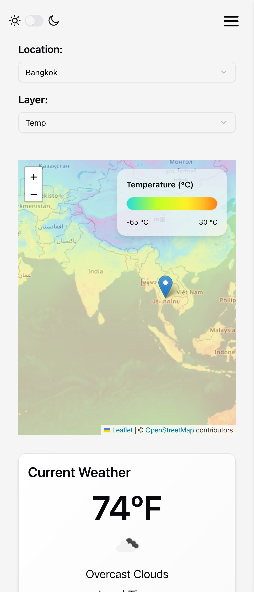

# Weather Dashboard

A React project that leverages the information provided by OpenWeather API to display useful weather statistics on a location selected on an interactive map provided with the help of Leaflet. Original project credit outlined below.


<div style="display: flex; align-items: center; justify-content: space-evenly">
  
  
</div>

## Features

- **OpenWeather API** - Various endpoints called to access weather data for a location
- **React Leaflet** - Connect with OpenWeather's data to create an interactive map
- **Dynamic Data** - Dashboard data updates immediately based on the map location, whether you choose from the pre-populated locations list, or interact with the map itself
- **Map Layers** - Choose a map layer to visualize clouds, temperature, precipitation, wind, and pressure
- **Responsive Design** - Mobile-first UI with Tailwind CSS and shadcn/ui

## Tech Stack

- React
- React Leaflet
- Vite
- TypeScript
- TanStack Query
- Axios
- Zod
- Tailwind CSS
- shadcn/ui

## OpenWeather API

This project makes use of free* APIs provided by OpenWeather.

- **Current weather API**
- **Hourly Forecast 4 days***
- **Daily Forecast 16 days***
- **Air Pollution API**
- **Geocoding API**

<small>* Free for students</small>

### `.env.local`

An API key is required to access [OpenWeather endpoints](https://openweathermap.org/api).

```env
# Obtain an API key at https://openweathermap.org/api
VITE_OPENWEATHER_KEY=
```

## Project Alterations

- Rather than using OpenWeather's One Call API 3.0, which requires payment information, different endpoints were used for fetching daily and hourly forecast data.
- The use of an Axios instance simplified calling the different APIs
- Modified TanStack queries used to account different endpoints
- Excluded MapTiler SDK -> issues importing required packages

## Acknowledgements

- [Build a Real React App With Me by Austin Davis](https://www.youtube.com/watch?v=M-iV9R3kLNA&t=16761s)
